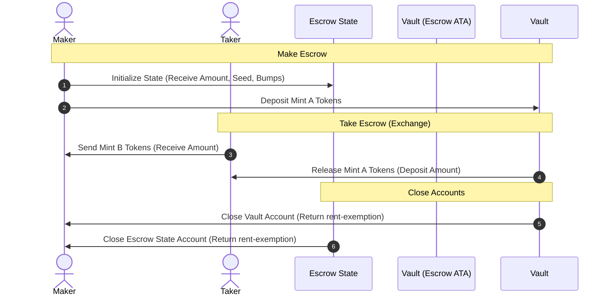

# Anchor Escrow (Q2 2026)

A secure, trustless token-to-token escrow program built using the **Anchor Framework**. This contract facilitates decentralized token exchange between two parties (a `maker` and a `taker`) without intermediate escrow agents.

---

## Program Info

- **Program ID**: `3SrnpRidwwR3hkzVrf5x9DkwDH3d9CAXHi2ZDbEarWBc`
- **Cluster**: `localnet` (configured in `Anchor.toml`)
- **Development Language**: Rust (Anchor Framework & Solana SPL Token)
- **Client Testing**: TypeScript (Mocha, Chai)

---

## Swap Flow Overview



1.  **Make**: The `maker` initializes the escrow contract, defining the `seed`, the token they want to lock up (`Mint A`), the token they want to receive (`Mint B`), and the target `receive` amount. They transfer the `deposit` amount of `Mint A` into a vault owned by the escrow program.
2.  **Take**: A `taker` accepts the escrow terms. The program checks that they have provided the correct amount of `Mint B` tokens, transfers them to the `maker`, transfers the locked `Mint A` tokens from the vault to the `taker`, and closes the vault and state accounts, returning rent lamports to the `maker`.
3.  **Refund**: If no taker has fulfilled the escrow, the `maker` can cancel it. The program transfers the locked `Mint A` tokens from the vault back to the `maker` and closes the vault and state accounts.

---

## Architecture & Account Layout

### 1. Escrow State Account (`Escrow`)
Stores the parameters and terms of the escrow.
```rust
#[account]
pub struct Escrow {
    pub seed: u64,
    pub maker: Pubkey,
    pub mint_a: Pubkey,
    pub mint_b: Pubkey,
    pub receive: u64,
    pub bump: u8,
}
```

*   **PDA Seeds**: `[b"escrow", maker_pubkey, seed.to_le_bytes()]`
*   **Space**: `8` (Anchor Discriminator) + `8` (seed) + `32` (maker) + `32` (mint_a) + `32` (mint_b) + `8` (receive) + `1` (bump) = `121 bytes`

### 2. Vault Account (`vault`)
The escrow's token account (Associated Token Account) holding the locked `Mint A` tokens. It is owned by the `Escrow` PDA.

---

## Instruction Set

### 1. `make(seed: u64, deposit: u64, receive: u64)`
Initializes the `Escrow` state and transfers `deposit` tokens from the maker's ATA to the `vault` ATA.
*   **Accounts Required**:
    *   `[signer, mut]` `maker`: Maker's wallet address.
    *   `[]` `mint_a`: The mint of the token deposited.
    *   `[]` `mint_b`: The mint of the token requested in return.
    *   `[mut]` `maker_ata_a`: Maker's Mint A token account.
    *   `[mut]` `escrow`: The derived `Escrow` PDA state account.
    *   `[mut]` `vault`: Associated Token Account of the `escrow` PDA for `Mint A`.
    *   `[]` `associated_token_program`: SPL Associated Token Program.
    *   `[]` `token_program`: SPL Token/Token2025 Program.
    *   `[]` `system_program`: Solana System Program.

### 2. `take`
Taker deposits the requested `Mint B` tokens to the `maker_ata_b`, receives the locked `Mint A` tokens from the `vault`, and closes the vault and escrow state accounts.
*   **Accounts Required**:
    *   `[signer, mut]` `taker`: Taker's wallet address.
    *   `[mut]` `maker`: Maker's wallet address (system account).
    *   `[]` `mint_a`: The mint of the deposited token.
    *   `[]` `mint_b`: The mint of the token requested in exchange.
    *   `[mut]` `taker_ata_a`: Taker's Mint A token account (receives vault tokens).
    *   `[mut]` `taker_ata_b`: Taker's Mint B token account (sends exchange tokens).
    *   `[mut]` `maker_ata_b`: Maker's Mint B token account (receives exchange tokens).
    *   `[mut]` `escrow`: The derived `Escrow` PDA.
    *   `[mut]` `vault`: Associated Token Account of the `escrow` PDA for `Mint A`.
    *   `[]` `associated_token_program`: SPL Associated Token Program.
    *   `[]` `token_program`: SPL Token/Token2025 Program.
    *   `[]` `system_program`: Solana System Program.

### 3. `refund`
Returns the locked `Mint A` tokens in the `vault` to the `maker_ata_a` and closes both the vault and escrow state accounts.
*   **Accounts Required**:
    *   `[signer, mut]` `maker`: Maker's wallet address.
    *   `[]` `mint_a`: The mint of the deposited token.
    *   `[mut]` `maker_ata_a`: Maker's Mint A token account.
    *   `[mut]` `escrow`: The derived `Escrow` PDA.
    *   `[mut]` `vault`: Associated Token Account of the `escrow` PDA for `Mint A`.
    *   `[]` `associated_token_program`: Associated Token Program.
    *   `[]` `token_program`: Token Program.
    *   `[]` `system_program`: System Program.

---

## Testing

Integration tests are implemented in [tests/anchor-escrow-q2-2026.ts](./tests/anchor-escrow-q2-2026.ts).

### Test Cases Covered:
1.  **Makes and refunds the escrow**: Checks that the maker can initialize an escrow and successfully refund/cancel it, verifying all accounts close and tokens are returned.
2.  **Makes and takes the escrow**: Checks the successful path where the taker fulfills the escrow, verifying that the taker receives Mint A, the maker receives Mint B, and the program closes all escrow-related accounts.

### Run Tests:
Ensure you are in the project folder and run:
```bash
yarn install
anchor test
```
